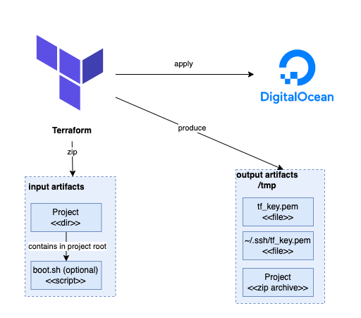

# Overview
It's a Terraform Project that can help you to create DigitalOcean droplet with managed architecture and SSH key based 
access.



**Project Actions:**
1. Creates new DigitalOcean Droplet with:
   - image: `ubuntu-20-04-x64`
   - name: `tf-vm`
   - size: `droplet_size`
   - region: `fra1`
2. Creates new TLS private key certificate.
3. Zips source project (with possible boot bash script inside).
4. Copies, unzips, and launches boot script on Droplet (if exists).

# Dependencies
1. Docker
2. Terraform
3. Digital Ocean [Personal Token](https://docs.digitalocean.com/reference/api/create-personal-access-token/)
4. Project: (_absolute path_) + bash script inside project root (_optional, uses as initial boot script_)

# Quick start
**1. Install Terraform**
```bash
brew tap hashicorp/tap
brew install hashicorp/tap/terraform
```

**2. Clone Repo**
```bash
git clone https://github.com/kholmanskykh/tf-droplet-project.git
```

**3. Prepare project to deploy:** 
   - add `boot.sh` script to project root (_optional_)
   - copy project absolute path (_put to env values_)

**4. Run inside repo**
```bash
# setup environment
export TF_VAR_do_token=token # digital ocean token
export TF_VAR_source_abs_project_path=path # project absolute path

# run terraform
terraform init
terraform apply -auto-approve

# or use makefile
make apply
```

**5. Output**

Terraform generates following output values and resources after successful run that you can use later:
- Droplet region
- Droplet IPv4 address
- `/tmp` directory with zipped project and SSH private key

**6. Destroy**

It is possible to destroy already created resources with:
```bash
terraform destroy-auto-approve

# or use makefile
make destory
```